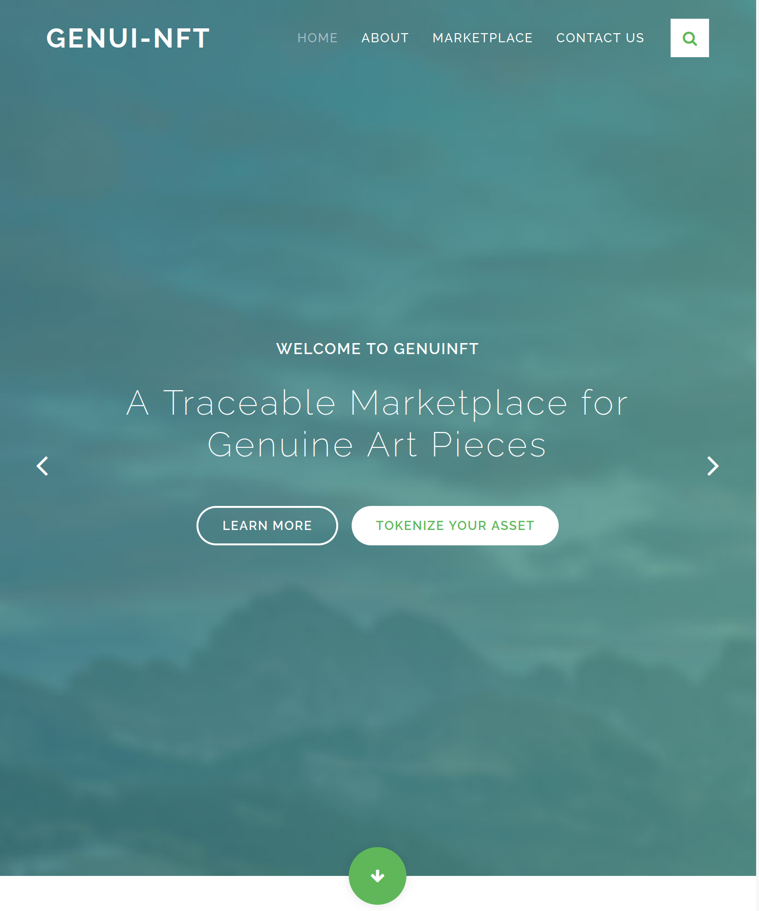
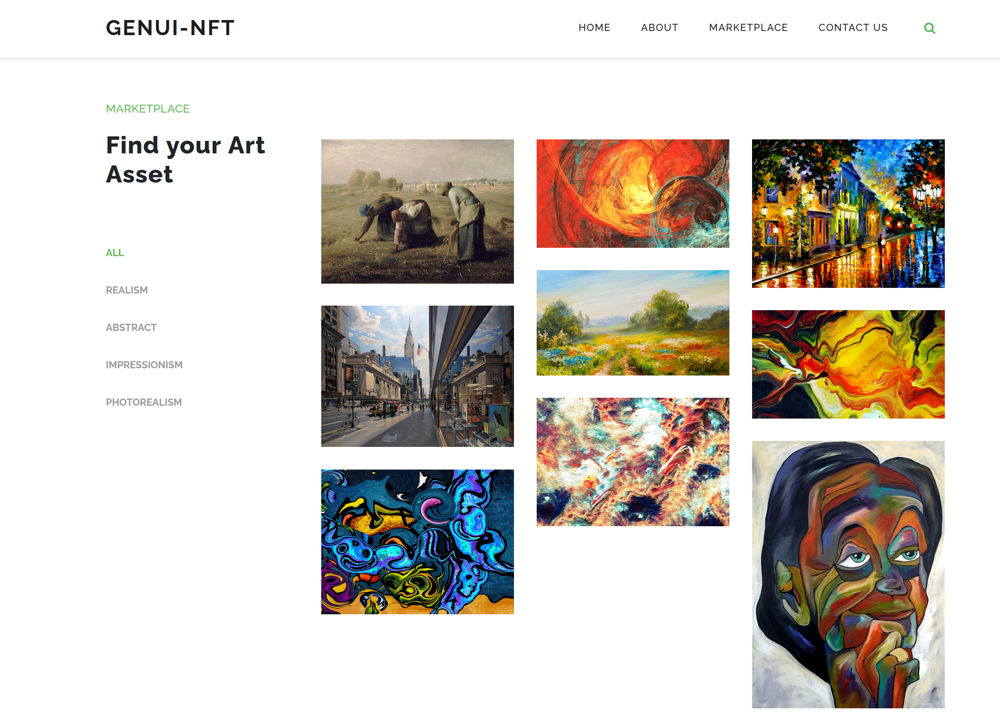

# Genui-NFT
## Summary
This project is a Dapp for allow users to create, exchange or transfer Art Asssets using the ERC-721 standard. It's build on top of Rinkeby (Ethereum testnet) and uses Ethereum core technologies like Truffle, Open Zeppelin and Solidity.
Smart contract generates a new token called "GEN" for transferring ownership between the stars created. This token can be found on Etherscan.

See details below for basic config and description and flow about the Dapp, as well as how to set it up and run the tests.

## Config & Basic Info
- ERC-721 Token Name: "GenuiNFT"
- Your ERC-721 Token Symbol: "GEN"
- Truffle v5.2.4 (core: 5.2.4)
- Solidity v0.5.16 (solc-js)
- Node v12.14.1
- Web3.js v^1.3.4 
- Openzeppelin-solidity@2.1.2

## Project Setup
### Smart Contracts
0. (Pre-requisites): You will need to have installed Metamask extension and Truffle.
1. Install the dependencies: ``npm i``
2. Open truffle development console in a new terminal: ``truffle develop``
3. Compile the smart contracts, inside the development console: ``compile``
4. Migrate the contracts locally: ``migrate --reset``. Note: if you want to migrate the contracts on Rinkeby testnet, you should configure a .env file following the .env-example file and run ``migrate --reset --network rinkeby``
5. Run unit tests, inside the development console: ``test``

### Frontend
1. Go inside app folder: ``cd app``
2. Install the dependencies: ``npm i``
3. Run the application on localhost:8080: ``npm run dev``

## Dapp Flow
The current frontend supports 2 main functionalities, though the backend contracts support more (see on the TODOs). The basic flow is as follows:
 ### Create a Token
 This will generate a new transaction and create an ERC721 token corresponding to that Star name and id.

 ### Look for a Token by Id
 This will search for a Star which maps that corresponding id.

## Running Mocha & Chai Tests
In this project, you can find the Unit Tests inside the test folder. 
As Truffle supports and comes preinstalled with Mocha and Chai this is the technology used.
You can run the tests with the commands:
1. ``truffle develop``
2. Inside the truffle console: ``test``

Chai is an Assertion Library

## TODO List
- [x] Art tokens created (GEN tokens).
- [x] Function that looks up the art assets using the Token ID, and then returns the name of the art piece.
- [x] Function called exchangeArt, so 2 users can exchange their art piece tokens.
- [x] Function for transfer art between owners.
- [x] Art tokens can be transferred from one address to another
- [x] Unit Tests added
- [ ] Deployment on Rinkeby
- [ ] Frontend version 1: support creation of tokens and look up for tokens by id
- [ ] Code refactor for separating styles from html
- [ ] Frontend version 2: support transfer of tokens and tokens exchange
- [ ] Design: optimize design for mobile, add responsiveness, improve last details